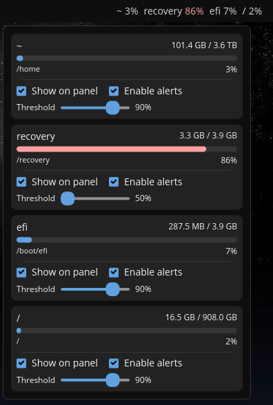

# Cargo Watch

A disk space monitor applet for COSMIC Desktop.

## Features

- Real-time disk usage monitoring via UDisks2 and statvfs
- Selected drives displayed in panel with usage percentage
- Detailed popup with all drives:
  - Drive name and mount point
  - Usage bar with used/total capacity
  - Click any drive to open in file manager
  - Per-drive panel visibility toggle
  - Per-drive alert enable/disable
  - Per-drive threshold slider (50-99%)
- Desktop notifications when drives exceed threshold
- Automatic filtering of virtual filesystems (tmpfs, squashfs, devtmpfs, etc.)
- Configurable poll interval
- Persistent configuration

## Screenshots



## Installation

Clone the repository:

```bash
git clone https://github.com/VintageTechie/cosmic-ext-applet-cargowatch
cd cosmic-ext-applet-cargowatch
```

Build and install the project:

```bash
just build-release
sudo just install
```

For alternative packaging methods:

- `deb`: run `just build-deb` and `sudo just install-deb`
- `rpm`: run `just build-rpm` and `sudo just install-rpm`

For vendoring, use `just vendor` and `just vendor-build`

## Configuration

Click the applet to open the popup where you can:

- Toggle which drives appear on the panel
- Enable or disable alerts for each drive
- Set the warning threshold per drive (default 90%)

Settings are automatically saved and persist across sessions. By default, `/` and `/home` are shown on the panel.

## Development

A [justfile](./justfile) is included with common recipes:

- `just build-debug` - Compile with debug profile
- `just check` - Run clippy linter
- `just check-json` - LSP-compatible linter output

## License

GPL-3.0-only - See [LICENSE](./LICENSE)
